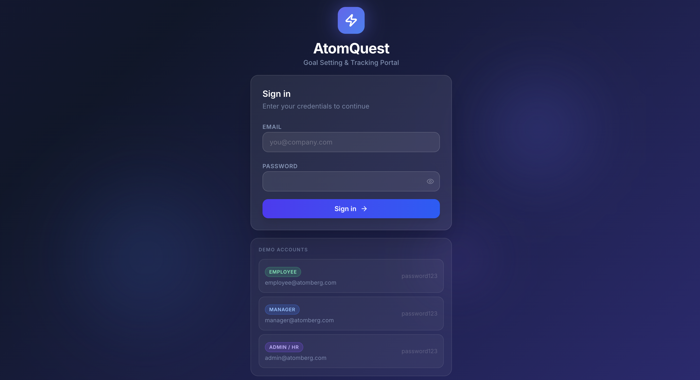
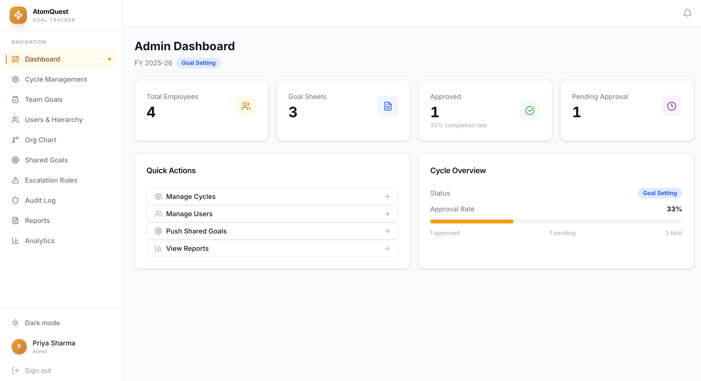
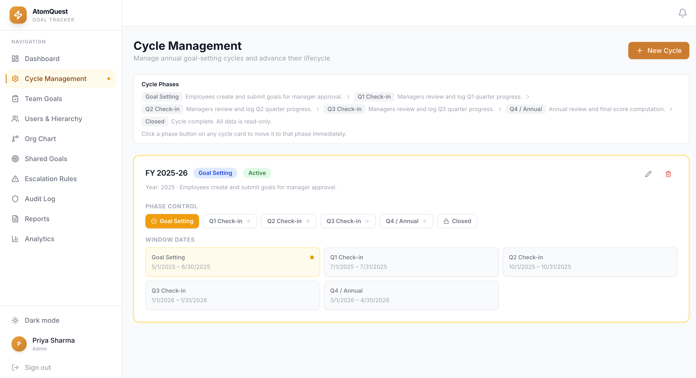
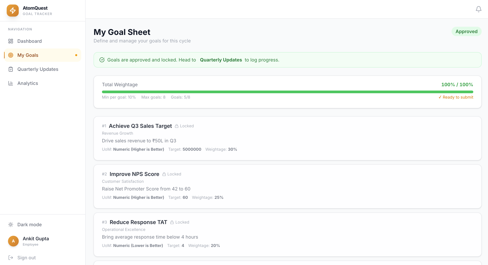
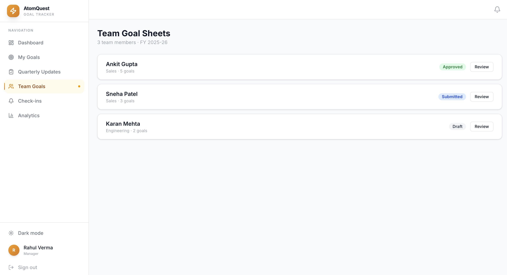
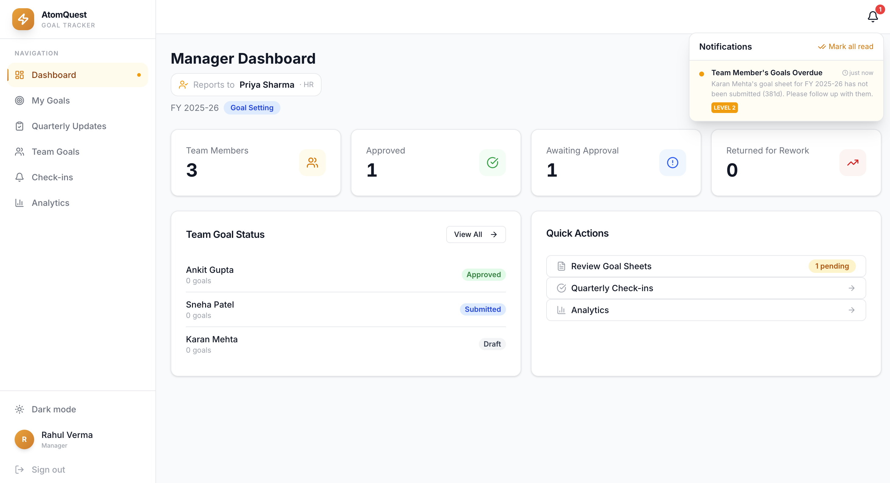
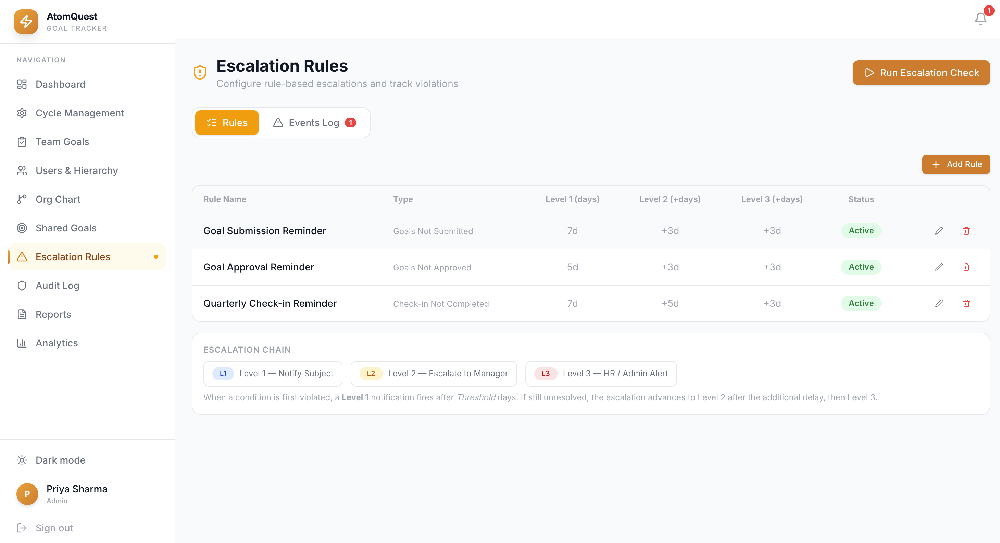
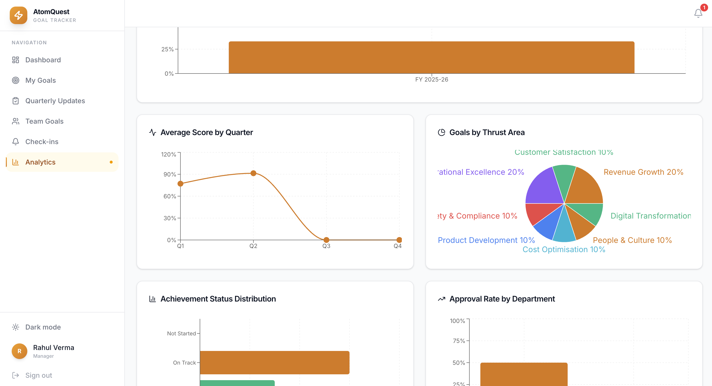

# ⚡ AtomQuest — Goal Setting & Tracking Portal

> An enterprise-grade OKR / goal-tracking system built for the **Atomberg Frontend Engineer Assignment**. Manages employee performance across an organisation through a full goal lifecycle — from setting to quarterly check-ins to annual review.

---

## ⚡ Run Locally

> **Prerequisites:** Node.js 20+ and npm installed

```bash
# 1. Clone the repo
git clone https://github.com/Harshit036/goal-tracker.git
cd goal-tracker

# 2. Install dependencies
npm install

# 3. Set up environment
cp .env.example .env

# 4. Run database migrations
npx prisma migrate dev

# 5. Seed demo data (users, goals, cycles)
npx ts-node --project tsconfig.json prisma/seed.ts

# 6. Start the dev server
npm run dev
```

Open **[http://localhost:3000](http://localhost:3000)** and log in with any of the credentials below.

---

## 🔗 Live Demo

**[https://goal-tracker-sigma-six.vercel.app/login](https://goal-tracker-sigma-six.vercel.app/login)**

---

## 🔐 Demo Credentials

| Role           | Email                 | Password      |
| -------------- | --------------------- | ------------- |
| **Admin / HR** | admin@atomberg.com    | `password123` |
| **Manager**    | manager@atomberg.com  | `password123` |
| **Employee**   | employee@atomberg.com | `password123` |

---

## 📸 Screenshots

### Login

<!-- Add screenshot: Login page -->



### Admin Dashboard

<!-- Add screenshot: Admin dashboard showing cycle + team overview -->



### Cycle Management

<!-- Add screenshot: Cycle phase stepper -->



### Goal Sheet — Employee View

<!-- Add screenshot: Employee creating/editing goals -->



### Manager Review

<!-- Add screenshot: Manager approving a goal sheet -->



### Notification Bell

<!-- Add screenshot: Notification bell dropdown -->



## 📸 Good to have Features (Bonus Points)

### Escalation Rules

<!-- Add screenshot: Admin escalation rules config + events log -->



### Analytics

<!-- Add screenshot: Charts & KPI dashboard -->



---

## 🛠 Tech Stack

| Layer     | Technology                               |
| --------- | ---------------------------------------- |
| Framework | Next.js 16 (App Router, Turbopack)       |
| Language  | TypeScript                               |
| Database  | SQLite (local) / Turso (production)      |
| ORM       | Prisma v7 with libsql adapter            |
| Auth      | Custom JWT via `jose` (httpOnly cookies) |
| UI        | Tailwind CSS v4 + Radix UI primitives    |
| Charts    | Recharts                                 |
| Icons     | Lucide React                             |
| Hosting   | Vercel (app) + Turso (DB)                |

---

## ✨ Features

### Core

**User & Hierarchy Management (Admin)**

- Create / edit / delete users with role assignment (Employee, Manager, Admin)
- Manager hierarchy with cyclic dependency detection and last-admin guard
- `@atomberg.com` email domain validation (client + server)
- Cascade deletion — removing a user cleans all their data while preserving audit history

**Goal Cycle Management (Admin)**

- Admin manually controls cycle phase via a phase stepper
- State machine: `GOAL_SETTING → Q1_CHECKIN → Q2_CHECKIN → Q3_CHECKIN → Q4_ANNUAL → CLOSED`
- Create, rename, and delete cycles

**Goal Sheet Flow**

- Employee creates goals (Thrust Area, UoM, Target, Weightage) → submits
- Validation: total weightage = 100%, min 10% per goal, max 8 goals
- Manager approves (locks goals) or returns for rework
- Admin can unlock approved sheets

**Quarterly Achievement Tracking**

- Employees log Q1–Q4 actuals per goal
- Auto-computed scores by UoM type: Numeric Min, Numeric Max, Timeline, Zero-based

**Manager Check-ins**

- Quarterly structured comments per goal sheet, tied to the active cycle phase

**Shared / Pushed Goals**

- Admin pushes a goal as a template to multiple employees

### Bonus

**Escalation Module (Rule-Based)**

- Three configurable trigger types:
  - `GOAL_NOT_SUBMITTED` — employee hasn't submitted within N days
  - `GOAL_NOT_APPROVED` — manager hasn't approved within N days
  - `CHECKIN_NOT_COMPLETED` — check-in not done within N days of window opening
- Three-level escalation chain per rule:
  - **L1** → notify the responsible party
  - **L2** → escalate to manager / skip-level
  - **L3** → HR / Admin alert
- Auto-resolution when the underlying condition clears
- Deduplication: same level notification never sent twice

**In-App Notification Bell**

- Real-time unread count badge (auto-refreshes every 60s)
- Dropdown panel with mark-as-read per notification or mark all read

**Analytics Dashboard** — Approval rates, scores by quarter, Thrust Area distribution, department completion

**Org Chart** — Visual reporting hierarchy tree

**Audit Log** — Immutable log with actor name snapshot (survives user deletion)

**CSV Reports** — Export achievement data per cycle

---

## 🏗 Architecture

See [`architecture-diagram.html`](./architecture-diagram.html) — open in browser → Print → Save as PDF.

Covers: system overview, ER diagram, RBAC, goal sheet state machine, cycle phase state machine, escalation flow, API route map, and deployment architecture.

---

## 📁 Project Structure

```
src/
├── app/
│   ├── (app)/                  # Authenticated shell (sidebar layout)
│   │   ├── admin/
│   │   │   ├── cycles/         # Cycle phase management
│   │   │   ├── escalation/     # Escalation rules + events log
│   │   │   ├── users/          # User management
│   │   │   ├── audit/          # Audit log
│   │   │   ├── hierarchy/      # Org chart
│   │   │   ├── reports/        # CSV export
│   │   │   └── shared-goals/
│   │   ├── manager/            # Team review + check-ins
│   │   ├── goals/              # Employee goal sheet
│   │   ├── achievements/       # Quarterly tracking
│   │   ├── analytics/          # Charts & KPIs
│   │   └── dashboard/          # Role-based dashboard
│   └── api/                    # API routes
├── components/
│   ├── ui/                     # Primitives (Button, Card, Badge…)
│   ├── Sidebar.tsx
│   └── NotificationBell.tsx
└── lib/
    ├── auth.ts
    ├── prisma.ts
    ├── audit.ts
    └── services/
        ├── cycle.service.ts
        ├── goalsheet.service.ts
        └── escalation.service.ts
prisma/
├── schema.prisma
├── migrations/
└── seed.ts
```

---

## 🎨 Design Principles

- **SOLID** — SRP (service layer), OCP (extensible phase/rule configs), LSP (canReviewGoalSheets predicate), ISP (client-safe constants vs server-only services), DIP (routes depend on service abstractions)
- **Security** — httpOnly JWT cookies, server-side RBAC on every route, bcrypt password hashing, email domain validation
- **Data integrity** — explicit cascade deletion order, cyclic hierarchy detection, last-admin guard
- **Audit trail** — actor name snapshotted at write time; logs survive account deletion
